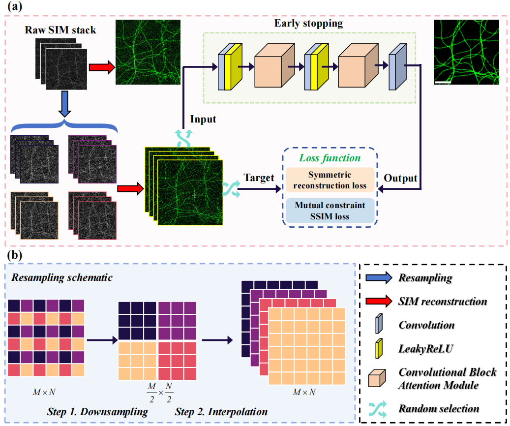

# ZS-SIM-main
### 📖 Zero-Shot Learning for Limited Photon Budget Denoising in Structured Illumination Microscopy

---
> **Double-blind note:** This repository intentionally omits author/affiliation information. Code and data are provided solely to reproduce results during peer review.

---
<p align="center">
  
</p>

## 🔍 Abstract
The structured illumination microscopy (SIM) technique, when applied under low photon efficiency, provides an effective solution for rapid live-cell imaging, thereby enabling the investigation of dynamic cellular processes. However, noise interference during the acquisition process significantly hinders the reconstruction of SIM images, leading to substantial artifacts. To address this challenge, we propose a zero-shot learning-based SIM image denoising method (ZS-SIM). This approach relies solely on a single acquisition of noisy SIM data and achieves accurate denoising through neural network training. The original SIM image stack is downsampled and interpolated to complete the resampling process, while the traditional Wiener-SIM reconstruction method is integrated to ensure physical fidelity. We introduce a symmetric reconstruction loss and a mutual constraint SSIM loss that jointly enhance training stability and accelerate convergence, as demonstrated by our convergence analysis. ZS-SIM further achieves a favorable balance between denoising quality and computational efficiency, with low model complexity and fast inference speed, making it well-suited for practical deployment in microscopy workflows. Experimental results demonstrate that ZS-SIM efficiently and rapidly achieves artifact-free, high-fidelity denoising reconstruction, making it particularly well-suited for low-photon efficiency live-cell imaging and scenarios with limited computational resources. Furthermore, by extending the method to scanning electron microscopy (SEM) data, we validate the effectiveness of ZS-SIM for SEM data denoising, significantly enhancing the performance of downstream segmentation tasks. We anticipate that ZS-SIM will play a pivotal role in low-photon efficiency imaging, driving advancements in this field and providing crucial support for rapid validation in biomedical research, thereby overcoming the challenges posed by acquisition noise.

## 🧪 What the pipeline does

**Input:** one noisy SIM raw stack (typically 9 frames: 3 angles × 3 phases).

**ZS-SIM pipeline**
1. **Sub-stack resampling:** pixel-wise downsampling with four spatial offsets → **4 sub-stacks**.
2. **Wiener-SIM reconstruction:** apply Wiener-SIM to each sub-stack **and** to the original stack  
   → **4 noisy SR sub-reconstructions** + **1 original noisy SR**.
3. **Zero-shot training:** randomly pick **two** sub-reconstructions → one as **input**, one as **target** (no clean GT required).
4. **Inference:** pass the **original** noisy SR through the trained network → **final denoised SR** image.


## 📦 Requirements & Installation

**Create & activate the environment**
```bash
conda env create -f ZSSIM_env.yml
conda activate ZSSIM
